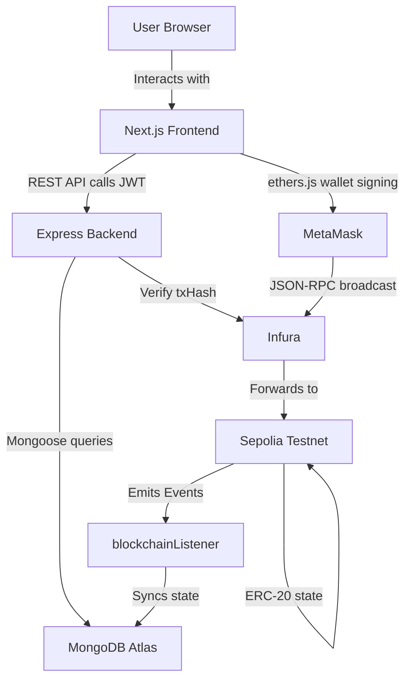

# 🏗️ Asset Tokenization Platform — Comprehensive Project Documentation

> **Project Type:** Full-Stack Web3 DApp  
> **Domain:** Real-World Asset (RWA) Tokenization & Decentralized Finance (DeFi)  
> **Network:** Ethereum Sepolia Testnet  
> **Last Updated:** October 2026

---

## 1. Project Overview

The **Asset Tokenization Platform** is a decentralized application (DApp) that bridges real-world assets — such as real estate, fine art, and luxury watches — with blockchain technology. It allows investors to buy and sell **fractional ownership** of high-value assets using ERC-20 tokens on the Ethereum Sepolia Testnet.

The platform operates as a **hybrid on-chain/off-chain** system:
- **On-chain**: Token ownership, transfers, and trading are secured by smart contracts.
- **Off-chain**: Asset metadata, user profiles, and transaction history are stored in MongoDB for fast querying and rich analytics.

---

## 2. Technical Stack

### 2.1 Frontend (`/client`)

| Technology | Version | Purpose |
|---|---|---|
| **Next.js** | 16.2.2 | React framework with App Router & SSR |
| **React** | 19.2.4 | UI component library |
| **ethers.js** | ^6.16.0 | Web3 wallet interaction & contract calls |
| **Recharts** | ^3.8.1 | Portfolio analytics charts |
| **lightweight-charts** | ^4.1.1 | Real-time price/trading charts |
| **Vanilla CSS / CSS Modules** | — | Custom styling |

### 2.2 Backend (`/server`)

| Technology | Version | Purpose |
|---|---|---|
| **Node.js** | v18+ | JavaScript runtime |
| **Express** | ^4.21.0 | REST API framework |
| **Mongoose** | ^8.5.1 | MongoDB ODM / ORM |
| **MongoDB** | Cloud (Atlas/Supabase) | Off-chain data persistence |
| **ethers.js** | ^6.17.0 | Server-side blockchain event listening |
| **JSON Web Token (JWT)** | ^9.0.2 | Authentication tokens |
| **bcryptjs** | ^2.4.3 | Password hashing |
| **Multer** | ^1.4.5 | Asset image/file upload handling |
| **dotenv** | ^16.4.5 | Environment variable management |
| **Nodemon** | ^3.1.4 | Dev server auto-restart |

### 2.3 Blockchain (`/blockchain`)

| Technology | Version | Purpose |
|---|---|---|
| **Solidity** | ^0.8.0 | Smart contract language |
| **Hardhat** | — | Ethereum development & deployment framework |
| **OpenZeppelin Contracts** | — | Secure, audited ERC-20 base contracts |
| **Infura RPC** | — | Ethereum node provider (Sepolia access) |

### 2.4 Infrastructure & Cloud

| Service | Purpose |
|---|---|
| **MongoDB Atlas** | Cloud database hosting |
| **Infura** | Ethereum Sepolia RPC endpoint |
| **Netlify / Vercel** | Frontend hosting & deployment |
| **Vercel Serverless** | Backend API deployment (`vercel.json`) |
| **MetaMask** | User wallet (browser extension) |

---

## 3. System Architecture

### 3.1 High-Level Architecture Diagram

```
┌──────────────────────────────────────────────────────────┐
│                    USER (Browser)                        │
│              MetaMask Wallet Extension                   │
└─────────────────────────┬────────────────────────────────┘
                          │
          ┌───────────────▼───────────────┐
          │       NEXT.JS FRONTEND        │
          │   (React + ethers.js + CSS)   │
          │   Deployed on: Netlify/Vercel │
          └────────┬──────────────────────┘
                   │                │
         HTTP REST API         Web3 (ethers.js)
                   │                │
    ┌──────────────▼──┐    ┌────────▼───────────────┐
    │  EXPRESS BACKEND │    │  ETHEREUM BLOCKCHAIN   │
    │  Node.js + JWT   │    │  Sepolia Testnet        │
    │  Deployed: Vercel│    │  via Infura RPC          │
    └──────────────┬───┘    └────────────────────────┘
                   │
         ┌─────────▼──────────┐
         │   MONGODB DATABASE  │
         │  (Atlas Cloud)      │
         │  Users, Assets,     │
         │  Transactions,      │
         │  Ownership Records  │
         └────────────────────┘
```

### 3.2 Data Flow Summary

| Layer | Responsibility |
|---|---|
| **Frontend** | Renders UI, reads API data, triggers wallet signing, sends tx hashes to backend |
| **MetaMask** | Signs and broadcasts Ethereum transactions on behalf of the user |
| **Smart Contracts** | Execute token transfers, trading orders, and liquidity operations on-chain |
| **Backend API** | Validates requests (JWT), syncs blockchain state, stores off-chain data |
| **MongoDB** | Persists user profiles, asset metadata, ownership records, transaction logs |
| **Blockchain Listener** | Background service — watches Sepolia events and auto-syncs MongoDB |

---

## 4. Directory Structure

```
Major-Project/
├── client/                        # Next.js Frontend
│   ├── app/
│   │   ├── admin/                 # Admin minting panel
│   │   ├── asset/                 # Asset detail + buy panel
│   │   ├── auth/                  # Login/register pages
│   │   ├── dashboard/             # User portfolio dashboard
│   │   ├── page.js                # Marketplace homepage
│   │   ├── layout.js              # Global layout wrapper
│   │   └── globals.css            # Global CSS styles
│   ├── components/                # Reusable UI components
│   ├── context/                   # React context providers (auth state, etc.)
│   ├── lib/                       # Utility functions & API helpers
│   ├── public/                    # Static assets (images, icons)
│   ├── next.config.mjs            # Next.js configuration
│   └── package.json
│
├── server/                        # Node.js + Express Backend
│   ├── config/
│   │   └── db.js                  # MongoDB connection setup
│   ├── controllers/
│   │   ├── adminController.js     # Admin API logic
│   │   ├── assetController.js     # Asset CRUD logic
│   │   ├── authController.js      # Authentication logic
│   │   └── transactionController.js # Buy/sell transaction logic
│   ├── middleware/                # JWT auth middleware
│   ├── models/
│   │   ├── Asset.js               # Asset schema
│   │   ├── User.js                # User schema
│   │   ├── Ownership.js           # Ownership (user ↔ asset) schema
│   │   └── Transaction.js         # Transaction history schema
│   ├── routes/
│   │   ├── auth.js                # /api/auth routes
│   │   ├── assets.js              # /api/assets routes
│   │   ├── transactions.js        # /api/transactions routes
│   │   ├── admin.js               # /api/admin routes
│   │   └── faucet.js              # /api/faucet routes
│   ├── services/
│   │   └── blockchainListener.js  # Real-time Sepolia event syncing
│   ├── uploads/                   # Uploaded asset images
│   ├── server.js                  # App entry point
│   ├── seed.js                    # DB seeding script
│   └── vercel.json                # Vercel serverless config
│
└── blockchain/                    # Hardhat Smart Contract Project
    ├── contracts/
    │   ├── PropertyToken.sol       # ERC-20 fractional ownership token
    │   ├── OrderBookMarketplace.sol # Peer-to-peer order book DEX
    │   └── BondingCurveAMM.sol    # Automated market maker (AMM)
    ├── scripts/
    │   └── deploy.js              # Contract deployment script
    ├── artifacts/                 # Compiled contract ABIs & bytecode
    ├── hardhat.config.js          # Hardhat network configuration
    └── package.json
```

---

## 5. Blockchain Layer — Smart Contracts

### 5.1 `PropertyToken.sol` — ERC-20 Fractional Ownership Token

**Inherits:** `OpenZeppelin ERC20`, `Ownable`

This is the core token contract. One instance is deployed **per real-world asset** listed on the platform.

| Function | Visibility | Description |
|---|---|---|
| `constructor(name, symbol, totalSupply, pricePerToken, propertyAddress)` | — | Deploys token, mints full supply to admin |
| `buyTokens(tokenCount)` | `external payable` | User buys tokens by sending Sepolia ETH |
| `distributeRental()` | `external payable onlyOwner` | Admin distributes rental yield to holders |
| `mint(address, amount)` | `external onlyOwner` | Admin mints additional tokens |
| `burn(address, amount)` | `external onlyOwner` | Admin burns tokens on redemption |

**Key Events:** `TokensPurchased`, `RentalDistributed`

---

### 5.2 `OrderBookMarketplace.sol` — Peer-to-Peer Secondary Market

A fully on-chain limit order book for trading property tokens between users.

| Function | Description |
|---|---|
| `placeBuyOrder(amount, price)` | Deposits ETH; creates a limit buy order |
| `placeSellOrder(amount, price)` | Deposits tokens; creates a limit sell order |
| `cancelOrder(orderId)` | Cancels order and refunds ETH/tokens to creator |
| `fillOrder(orderId, amountToFill)` | Fills an existing open order |

**Order Struct:**
```solidity
struct Order {
    uint256 id;
    uint256 amount;
    uint256 price;   // Price per token in wei
    address user;
    bool isBuyOrder;
    bool isActive;
}
```

**Key Events:** `OrderPlaced`, `OrderFilled`, `OrderCancelled`

---

### 5.3 `BondingCurveAMM.sol` — Automated Market Maker

Provides **instant liquidity** using a mathematical bonding curve formula `P = f(Supply)`. Users can always buy or sell tokens even with no matching peer order — the price adjusts algorithmically with supply and demand.

---

## 6. Backend API Layer

### 6.1 Server Entry Point (`server.js`)

- Initializes Express, connects MongoDB, sets up CORS
- Starts `blockchainListener` to sync on-chain events automatically
- Exposes static file serving for uploads

### 6.2 Database Models (Mongoose Schemas)

#### `Asset.js`
```
title, description, category (Real Estate / Fine Art / Watches)
totalValuation, pricePerToken, totalSupply, availableTokens
contractAddress (deployed ERC-20 address on Sepolia)
imageUrl, location, documents[]
```

#### `User.js`
```
walletAddress (unique, lowercase Ethereum address)
email, name, role (user | admin)
passwordHash (via bcryptjs)
```

#### `Ownership.js`
```
user  → ref: User
asset → ref: Asset
tokensOwned, purchasePrice
```

#### `Transaction.js`
```
user, asset, txHash
tokenAmount, totalCost
status: pending | confirmed | failed
type: buy | sell
timestamp
```

---

### 6.3 REST API Endpoints

#### Auth — `/api/auth`
| Method | Endpoint | Description |
|---|---|---|
| `POST` | `/login` | Login or auto-register a user by wallet address + JWT |
| `POST` | `/register` | Manual registration with email/password |

#### Assets — `/api/assets`
| Method | Endpoint | Description |
|---|---|---|
| `GET` | `/` | List all tokenized assets |
| `GET` | `/:id` | Get asset details + smart contract address |
| `POST` | `/` | *(Admin)* Mint and list a new tokenized asset |
| `PUT` | `/:id` | *(Admin)* Update asset metadata |
| `DELETE` | `/:id` | *(Admin)* Remove an asset listing |

#### Transactions — `/api/transactions`
| Method | Endpoint | Description |
|---|---|---|
| `POST` | `/buy` | Record a primary market token purchase |
| `POST` | `/sell` | Record a secondary market token sale |
| `GET` | `/history` | Get user's full transaction history |

#### Admin — `/api/admin`
| Method | Endpoint | Description |
|---|---|---|
| `GET` | `/users` | List all platform users |
| `GET` | `/stats` | Platform-wide analytics |

#### Faucet — `/api/faucet`
| Method | Endpoint | Description |
|---|---|---|
| `POST` | `/request` | Request test ETH/tokens for development |

#### Health Check
| Method | Endpoint | Description |
|---|---|---|
| `GET` | `/api/health` | Returns server status and timestamp |

---

### 6.4 Blockchain Listener Service (`blockchainListener.js`)

A background service running on the server that:
1. **Connects to Sepolia** via Infura RPC using `ethers.js`
2. **Listens for on-chain events** — `TokensPurchased`, `OrderFilled`, etc.
3. **Syncs MongoDB automatically** — updates asset supply, ownership records, and transaction status without requiring the frontend to poll

This ensures the database remains consistent even if a user's browser crashes after a transaction is mined.

---

## 7. Frontend Layer

### 7.1 Application Pages (App Router)

| Route | File | Description |
|---|---|---|
| `/` | `app/page.js` | Marketplace — lists all tokenized assets with filters |
| `/asset/[id]` | `app/asset/` | Asset details, financial metrics, Buy Tokens panel |
| `/dashboard` | `app/dashboard/` | User portfolio, token holdings, P&L, transaction log |
| `/admin` | `app/admin/` | Admin panel — list new assets, view platform stats |
| `/auth` | `app/auth/` | Login / register page |

### 7.2 Key Frontend Components

| Component | Purpose |
|---|---|
| `components/` | Reusable UI: Cards, Modals, Navbar, Loaders |
| `context/` | Global auth state via React Context API |
| `lib/` | API client helpers, ethers.js utility functions |

### 7.3 Web3 Integration (ethers.js)

1. **Wallet Connection**: `ethers.BrowserProvider(window.ethereum)` connects to MetaMask
2. **Contract Instance**: `ethers.Contract(address, abi, signer)` wraps the deployed `PropertyToken`
3. **Send Transaction**: Calls `propertyToken.buyTokens(count, { value: ethAmount })` — MetaMask pops up for user approval
4. **Receive txHash**: Waits for `tx.wait()` confirmation, then sends `txHash` to backend

---

## 8. End-to-End Transaction Flow

### 8.1 Primary Market — Token Purchase

```
1. User browses the Marketplace and selects an asset
        │
2. User enters quantity and clicks "Buy Tokens"
        │
3. Frontend connects to MetaMask (ethers.BrowserProvider)
        │
4. Frontend calls PropertyToken.buyTokens(count) with ETH value
        │
5. MetaMask prompts user to sign and broadcast on Sepolia Testnet
        │
6. Transaction is mined on the Sepolia blockchain (~12 seconds)
        │
7. Frontend receives txHash from ethers.js
        │
8. Frontend POSTs txHash + details to /api/transactions/buy
        │
9. Backend verifies txHash via Infura RPC (confirms on-chain)
        │
10. MongoDB updates:
     - Asset.availableTokens  ← decremented
     - Ownership.tokensOwned  ← incremented
     - Transaction.status     ← 'confirmed'
        │
11. Dashboard refreshes to reflect new holdings
```

### 8.2 Secondary Market — P2P Order Book Trade

```
Seller: placeSellOrder(tokenAmount, pricePerToken)
  → Deposits tokens into OrderBookMarketplace contract

Buyer: fillOrder(orderId, amountToFill) with ETH
  → Contract transfers tokens to buyer, ETH to seller atomically

Backend listener picks up OrderFilled event
  → Updates both users' Ownership and Transaction records in MongoDB
```

### 8.3 Authentication Flow

```
User enters wallet address (or email/password)
        │
POST /api/auth/login
        │
Backend looks up walletAddress in Users collection
  ├── Exists → generates JWT
  └── Not found → auto-registers user, generates JWT
        │
Frontend stores JWT in localStorage/cookies
        │
JWT sent as Authorization: Bearer <token> on all protected API calls
        │
Backend middleware verifies JWT signature (jsonwebtoken) before each request
```

---

## 9. Integration Architecture

```
┌─────────────────────────────────────────────────────┐
│                  INTEGRATION MAP                    │
│                                                     │
│  Frontend ──HTTP──▶ Backend ──Mongoose──▶ MongoDB   │
│  Frontend ──ethers.js──▶ MetaMask                   │
│  MetaMask ──JSON-RPC──▶ Infura ──▶ Sepolia Network  │
│  Sepolia Event ──▶ blockchainListener ──▶ MongoDB   │
│  Backend ──ethers.js──▶ Infura ──▶ Sepolia (verify) │
│                                                     │
│  CI/CD: Git ──▶ Vercel (backend + frontend deploy)  │
└─────────────────────────────────────────────────────┘
```

---

## 10. Security Design

| Concern | Implementation |
|---|---|
| **Authentication** | JWT tokens signed with `JWT_SECRET`, expiry enforced |
| **Authorization** | Role-based middleware (`admin` / `user`) on sensitive routes |
| **Wallet Verification** | Wallet address lowercased and uniquely indexed in DB |
| **Smart Contract Security** | OpenZeppelin `Ownable` restricts admin functions to deployer |
| **Transaction Verification** | Backend independently verifies `txHash` on Sepolia via Infura before updating DB |
| **CORS** | Restricted to known origins (`localhost`, `.vercel.app`) |
| **File Uploads** | Multer limits file type/size for uploaded asset images |

---

## 11. Deployment Architecture

### Frontend — Netlify / Vercel
- `npm run build` → Next.js static + SSR build
- Auto-deploys from `main` branch via Git integration
- Environment variable: `NEXT_PUBLIC_API_URL` set to backend URL

### Backend — Vercel Serverless
- `vercel.json` configures Express as a serverless function
- Environment variables: `MONGO_URI`, `JWT_SECRET`, `SEPOLIA_RPC_URL`, `FRONTEND_URL`

### Smart Contracts — Sepolia Testnet
- Deployed once using `npx hardhat run scripts/deploy.js --network sepolia`
- Contract addresses saved and referenced in backend `.env` and frontend config

---

## 12. Local Development Setup

### Prerequisites
- Node.js v18+
- MetaMask browser extension
- Sepolia test ETH (from a faucet)
- MongoDB Atlas account or local MongoDB
- Infura project ID

### Step 1 — Backend

```bash
cd server
npm install
```

Create `server/.env`:
```env
PORT=5000
MONGO_URI=mongodb+srv://your_connection_string
JWT_SECRET=your_secret_key
SEPOLIA_RPC_URL=https://sepolia.infura.io/v3/YOUR_INFURA_ID
FRONTEND_URL=http://localhost:3000
```

```bash
npm run dev        # Starts on http://localhost:5000
```

### Step 2 — Frontend

```bash
cd client
npm install
```

Create `client/.env.local`:
```env
NEXT_PUBLIC_API_URL=http://localhost:5000/api
```

```bash
npm run dev        # Starts on http://localhost:3000
```

### Step 3 — Smart Contracts (Optional)

```bash
cd blockchain
npm install
```

Create `blockchain/.env`:
```env
SEPOLIA_RPC_URL=https://sepolia.infura.io/v3/YOUR_INFURA_ID
PRIVATE_KEY=your_metamask_wallet_private_key
```

```bash
npx hardhat compile
npx hardhat run scripts/deploy.js --network sepolia
```

---

## 13. Key Algorithms & Design Patterns

| Algorithm / Pattern | Where Used | Purpose |
|---|---|---|
| **ERC-20 Token Standard** | `PropertyToken.sol` | Fungible token representing fractional asset share |
| **Limit Order Book** | `OrderBookMarketplace.sol` | Peer-to-peer price discovery and matching |
| **Bonding Curve AMM** | `BondingCurveAMM.sol` | Algorithmic liquidity without counterparty |
| **JWT Auth** | Backend middleware | Stateless authentication |
| **Event-Driven Sync** | `blockchainListener.js` | Keeps MongoDB in sync with Sepolia events |
| **Repository Pattern** | Controllers + Models | Separation of data logic from route handlers |
| **Context API** | Frontend `context/` | Global state management without Redux |
| **App Router (Next.js)** | `client/app/` | File-based routing with SSR/SSG support |

---

## 14. Component Interaction Summary


